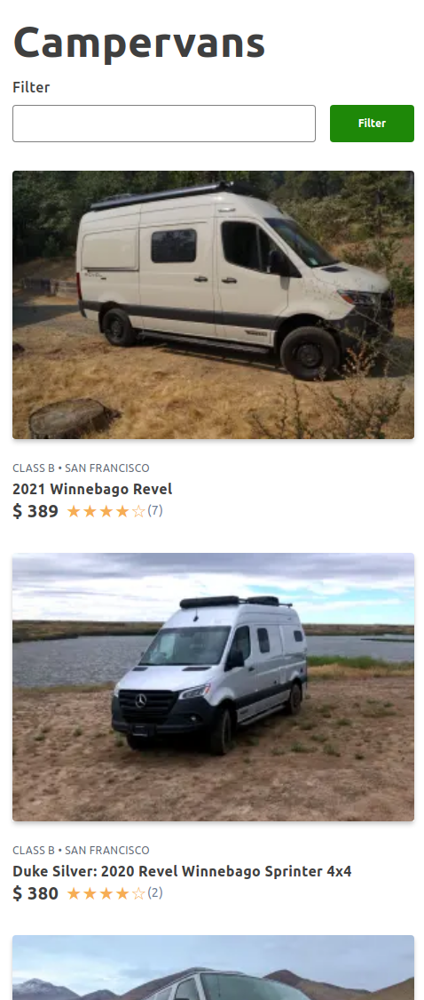

# Outdoorsy NextJS Techincal Demo

In this technical challenge / demo I would like to mention TailwindCSS is one of my preferred ways to work with CSS so it felt like a great default.

I have added a few elements that were not required, but I think showcase an often overlook part of a website:

In the SearchItem component we can see how the `cloudinary` api was researched and put into work to deliver images in next gen formats as well as properly resized.

Using NextJS I was able to pre render both pages so search engines can index better the contents of the site, assuming this as a production app.   

## Stack

* Typescript
* NextJS
* TailwindCSS
* Node Fetch

## Live Preview

It is available at 

## Running / Development

* `yarn install`
* `yarn dev`
* Open the app [http://localhost:3000](http://localhost:3000).

## Screenshots

